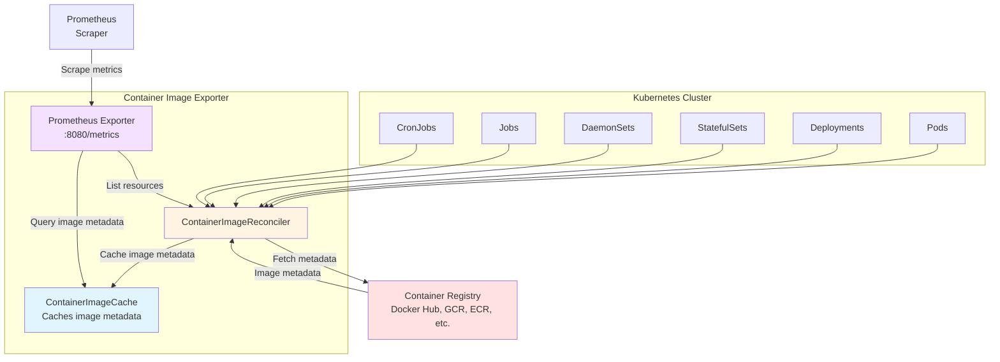
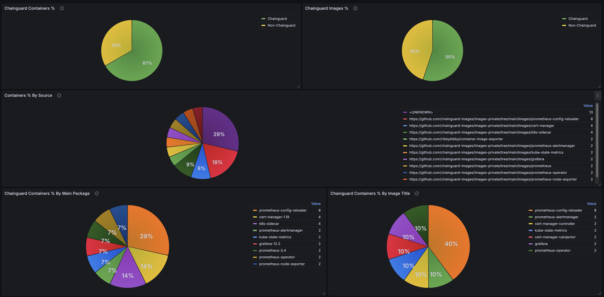

# container-image-exporter

Export information about container images configured in a Kubernetes cluster.



## Installation

The default static configuration can be installed as follows:

```
kubectl apply -f https://raw.githubusercontent.com/ribbybibby/container-image-exporter/refs/heads/main/deploy/manifests/container-image-exporter.yaml
```

The service is annotated with these values, which are commonly used to discover
scrape targets in Kubernetes.

```
prometheus.io/scrape: "true"
prometheus.io/port: "8080"
prometheus.io/path: "/metrics"
```

If you are using the [Prometheus
Operator](https://github.com/prometheus-operator/prometheus-operator) you can
scrape the metrics with a `ServiceMonitor` like this:

```
apiVersion: monitoring.coreos.com/v1
kind: ServiceMonitor
metadata:
  name: container-image-exporter
spec:
  endpoints:
  - path: /metrics
    port: metrics
  namespaceSelector:
    matchNames:
    - container-image-exporter
  selector:
    matchLabels:
      app.kubernetes.io/name: container-image-exporter
```

## Metrics

| Metric                          | Description                                                                                            | Labels                                                         |
| ------------------------------- | ------------------------------------------------------------------------------------------------------ | -------------------------------------------------------------- |
| container_image_container_info  | Details about containers running in the cluster, including the image digest resolved by the exporter.  | group, version, kind, namespace, name, jsonpath, image, digest |
| container_image_annotation      | Annotations from the image manifest.                                                                   | digest, key, value                                             |
| container_image_label           | Labels from the image config.                                                                          | digest, key, value                                             |
| container_image_size_bytes      | The size of the image in the registry.                                                                 | digest                                                         |
| container_image_created         | The created date from the image config. Expressed as a Unix Epoch Time.                                | digest                                                         |

## Dashboards

See [dashboards](./dashboards) for examples of Grafana dashboards that consume
the exporter's metrics.



## Demo

See [demo](./demo) for a demonstration of how to use this exporter to track
adoption of Chainguard Containers.

## Configuration

### Credentials

The exporter will attempt to fetch registry credentials from any pull secrets
configured for the target resources, in the same way that the kubelet would
when running a pod.

Additionally, it will use any available cloud-specific credentials that are
configured for the `container-image-inventory` pod when interacting with
Google Container Registry, Google Artifact Registry, AWS ECR or Azure
Container Registry.

You can also modify the contents of the
`container-image-inventory-docker-config` secret to add static credentials for
other registries.

### Cache Duration

To reduce the number of requests made to upstream registries, the exporter will
cache the response for each image for a configurable amount of time. The default
is 1 hour.

You can modify this duration with the `--cache-duration=6h` flag.

### Multi-Architecture Images

The exporter doesn't know the architecture of the node that a given container
spec will ultimately be deployed to. So, when it encounters a multi-architecture
image, it will resolve it to the `linux/amd64` image, or if that platform is
absent, the first image in the list.

In general, images in the same index share the same or very similar metadata,
so the metrics that are returned are typically still useful and representative,
even if they aren't taken from the image that will ultimately be deployed to a
node.

You can configure the exporter to default to a different platform with the
`--platform=linux/arm64` flag.

## Example Queries

### Percentage of Containers Based on Chainguard

Unless they are specifically overwritten, Docker will persist the labels from
the base image in the images it builds. This means you can use those labels to
infer various things about the images defined in your clusters.

For instance, you could use the presence of the `dev.chainguard.package.main`
label to calculate the percentage of containers defined in the cluster that are
using Chainguard images or images based on Chainguard.

```
  (
      count(
        container_image_container_info{kind!="Pod"}
        * on (digest) group_left (value)
          container_image_label{key="dev.chainguard.package.main"}
      )
    /
      count(
        container_image_container_info{kind!="Pod"}
      )
  )
*
  100
```

This query excludes pods so that it is measuring the container specs that are
directly configured by the user (i.e Deployments, StatefulSets, CronJobs).

This is typically a better way to measure the number of 'applications that
still need to be migrated to Chainguard' than looking at the running
containers, which can be skewed by, for instance, Deployments or Daemonsets
that run 100s of pods versus a StatefulSet that runs a handful.

### Images Older Than X Number of Days

Frequently rebuilding your images from up to date base images is an effective
way to ensure you are incorporating CVE fixes.

You can use `container_image_created` to identify images that weren't built
recently.

For instance, this query returns series for images that were created more than
14 days ago.

```
    time()
  -
    (
        max by (digest, image) (container_image_container_info)
      * on (digest) group_left ()
        container_image_created
    )
>
  86400 * 14
```

It's worth noting that not all build tools will set the `created` timestamp when
they build an image.
