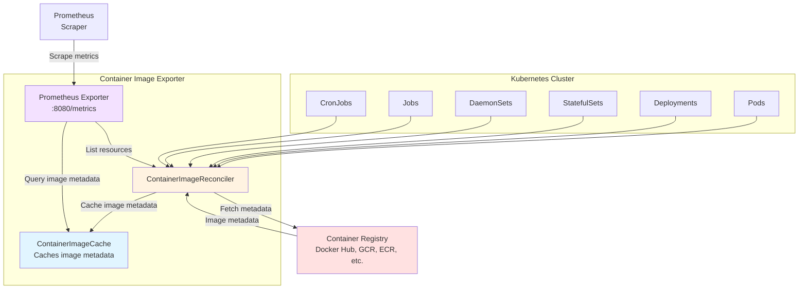

# Container Image Exporter Architecture

## System Overview

```mermaid
graph TB
    subgraph "Kubernetes Cluster"
        POD[Pods]
        DEPLOY[Deployments]
        STS[StatefulSets]
        DS[DaemonSets]
        JOB[Jobs]
        CRON[CronJobs]
    end

    subgraph "Container Image Exporter"
        RECONCILER[ContainerImageReconciler]
        CACHE[ContainerImageCache<br/>Caches image metadata]
        EXPORTER[Prometheus Exporter<br/>:8080/metrics]
    end

    REGISTRY[Container Registry<br/>Docker Hub, GCR, ECR, etc.]
    PROM[Prometheus<br/>Scraper]

    POD --> RECONCILER
    DEPLOY --> RECONCILER
    STS --> RECONCILER
    DS --> RECONCILER
    JOB --> RECONCILER
    CRON --> RECONCILER

    RECONCILER -->|Fetch metadata| REGISTRY
    REGISTRY -->|Image metadata| RECONCILER
    RECONCILER -->|Cache image metadata| CACHE

    EXPORTER -->|Query image metadata| CACHE
    EXPORTER -->|List resources| RECONCILER
    PROM -->|Scrape metrics| EXPORTER

    style CACHE fill:#e1f5ff
    style RECONCILER fill:#fff3e1
    style EXPORTER fill:#f3e1ff
    style REGISTRY fill:#ffe1e1
```
