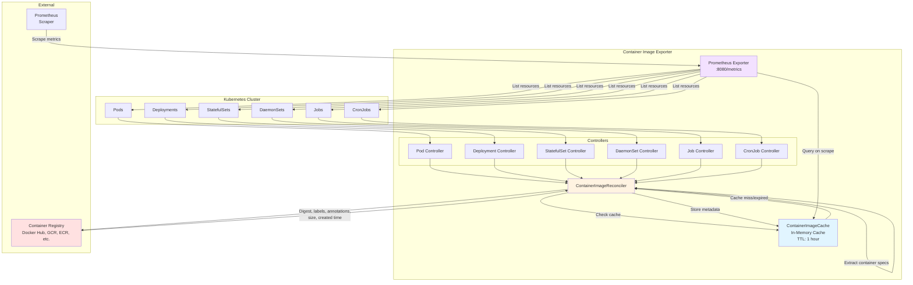
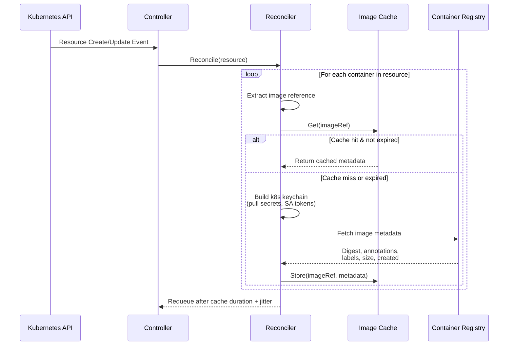
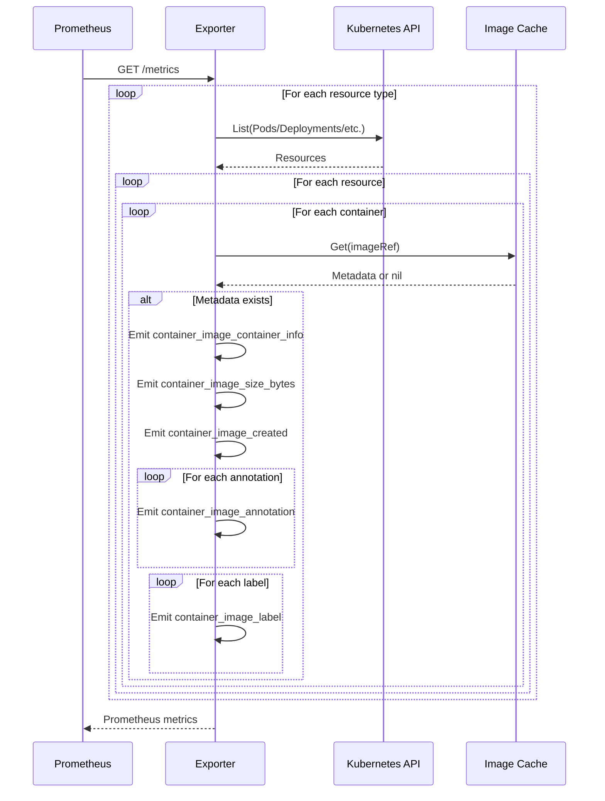
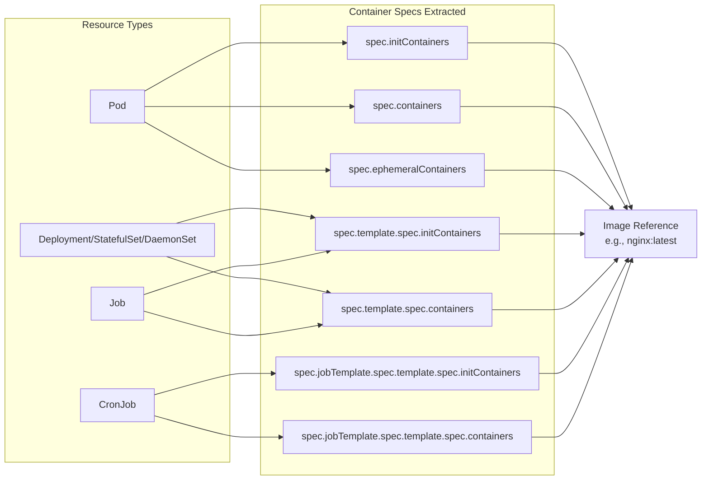
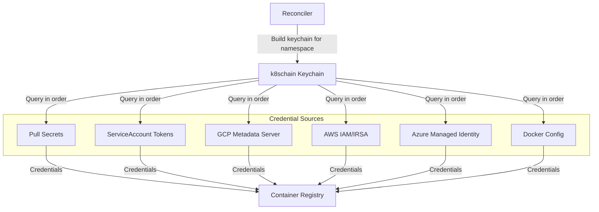

# Container Image Exporter Architecture

## System Overview

## Reconciliation Flow

## Metrics Export Flow

## Data Extraction from Kubernetes Resources

## Exported Metrics

The exporter provides the following Prometheus metrics:

1. **container_image_container_info** (gauge)
   - Labels: `group`, `version`, `kind`, `namespace`, `name`, `jsonpath`, `image`, `digest`
   - Links containers to their image digests

2. **container_image_annotation** (gauge)
   - Labels: `digest`, `key`, `value`
   - Exposes manifest annotations from the image

3. **container_image_label** (gauge)
   - Labels: `digest`, `key`, `value`
   - Exposes config labels from the image

4. **container_image_size_bytes** (gauge)
   - Labels: `digest`
   - Total size of image in the registry (config + all layers)

5. **container_image_created** (gauge)
   - Labels: `digest`
   - Unix timestamp when the image was created

## Authentication Flow

